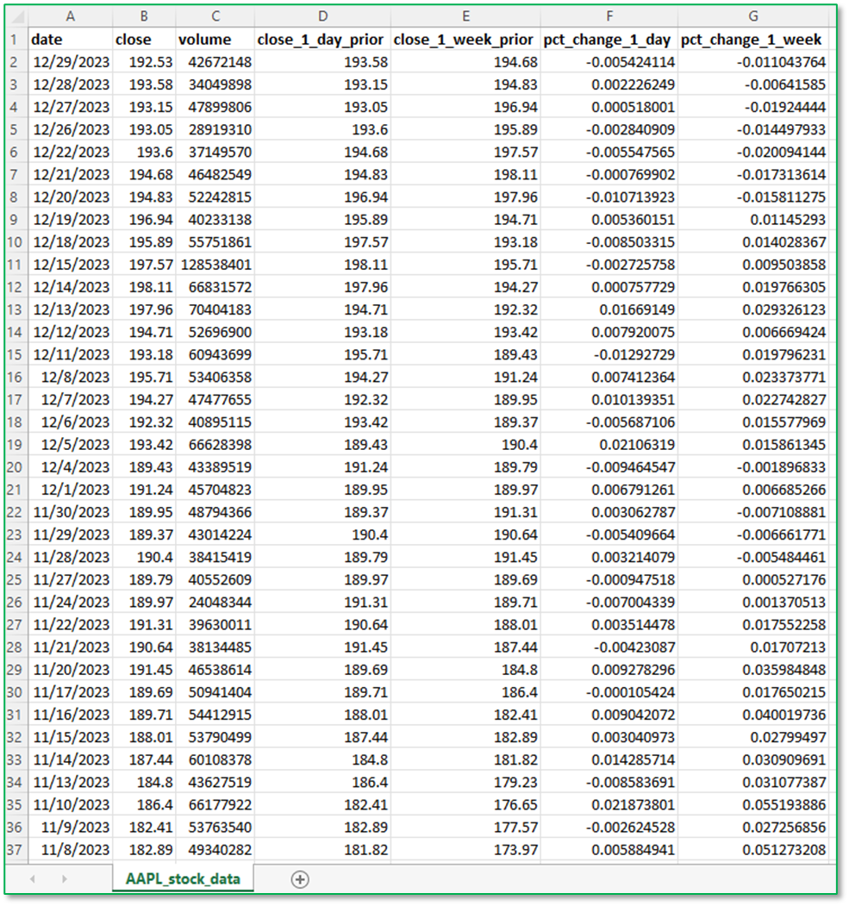
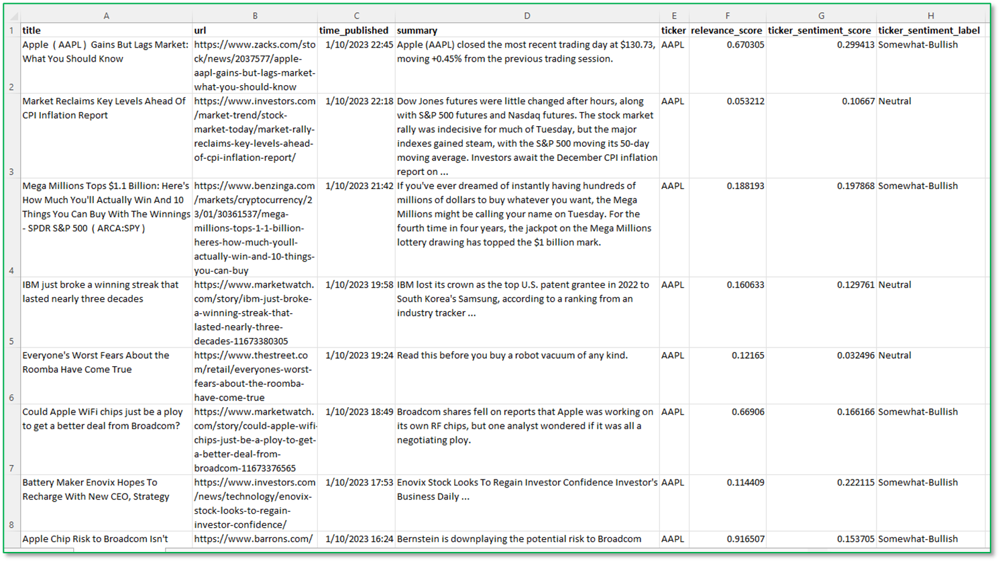
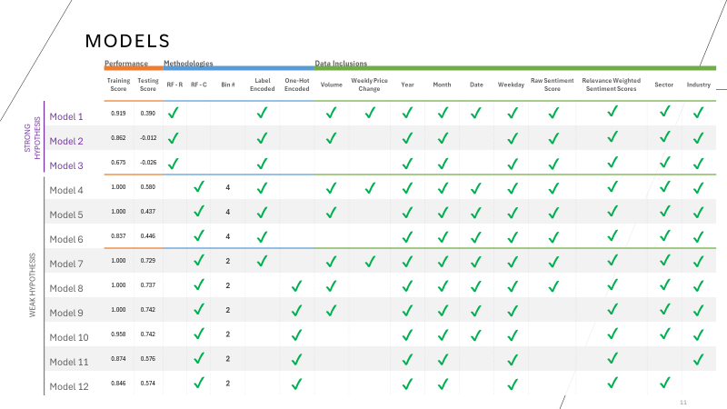
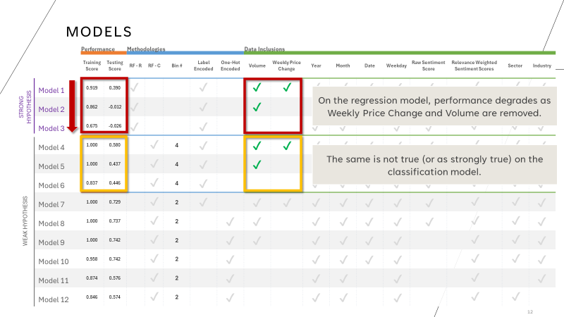
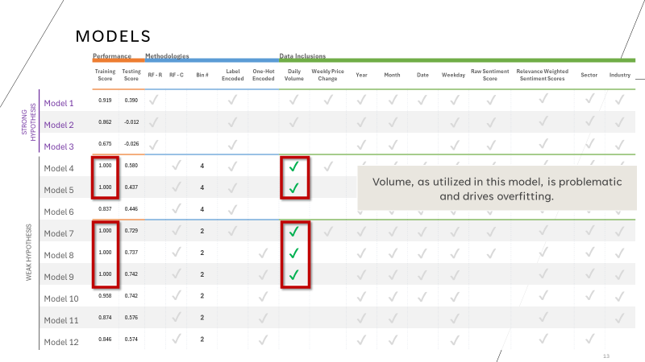
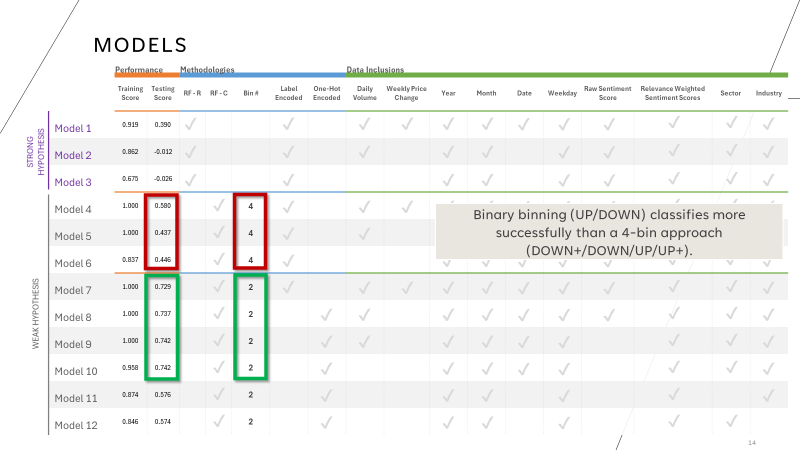
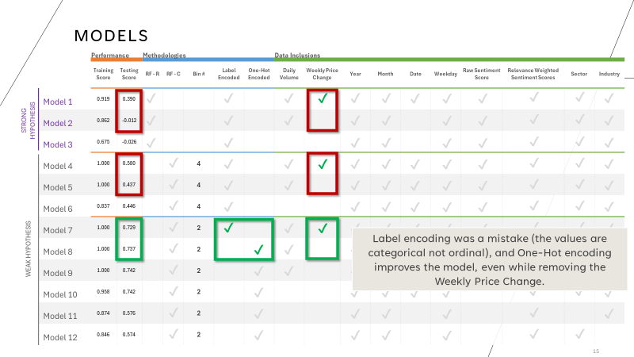
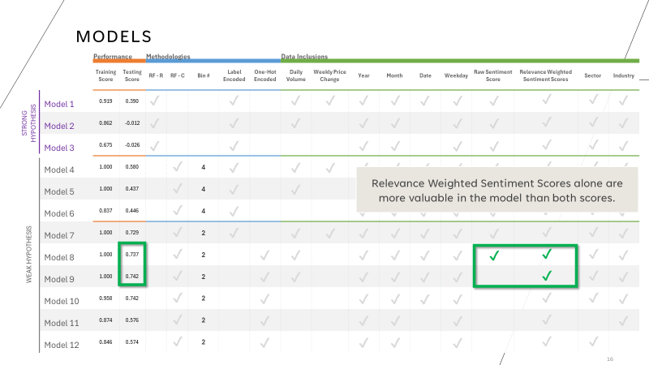
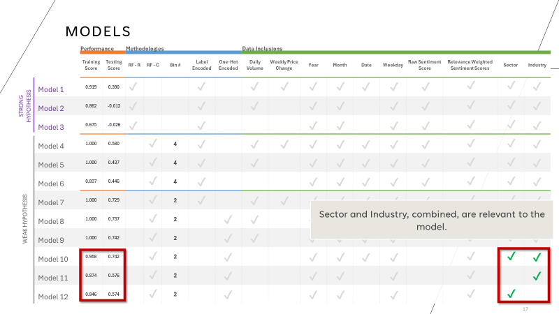
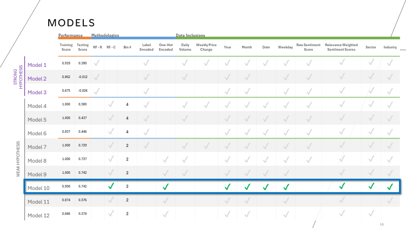

# AIBC_Project_2
OSU AI Boot Camp 
Project Two
Shawn Feils &amp; Chelsey Hay

# Overview
For this project, we were tasked with using maching learning (ML) to analyze a problem. 

 utilized a machine learning model to determine whether the general performance of a stock could be predicted using the sentiment of a stock related to the various news articles published on the 

# Research Question
For this project, our research question was: can we use maching learning to predict the variance of a stock price using news reporting setmients?
* A strong hypothesis is that the model will allow us to predict the magnitude and direction of variance based on sentiment (regression)
* A weak hypothesis is that the model will allow us to predict the direction of variance based on sentiment (classification)

# Approach
We have broken out our approach into Data Retrieval and Cleanup and the analysis can be found below in the "Results" section.
### Data Retrieval
We utilized Alpha Vantage and the S&P 500 to retrieve the data that was needed for this exercise.

*Alpha Vantage*
* We accessed Alpha Vantage using an API
* Gathered historical daily closing prices on stocks within the S&P 500
* Gathered all news articles published for the stocks in 2023 (some stocks did not have data)
* Retrieved relevance scores for every stock listed in the news articles & exported into CSV files for each stock
* Retrieved sentiment scores for every stock listed in the article & exported into CSV files for each stock

*S&P 500*
* Accessed the S&P 500 to download a CSV with all S&P 500 stock ticker information
### Data Clean Up 
*Stocks*
* Exported all data into CSV individual files
* Created a data frame
* Added a percent change from prior day and prior week for historical stock prices
* Grouped each stock by time period (pre-market, intra-day, after-market)
* Created a pivot to combine the time period data into one data frame

*News Articles*
* Exported all data into individual files
* Reduced the news article data to focus on just the stock we were analyzing (some articles reference multiple stocks)
* Created a data frame
* Created a relevance weighted sentiment score for the articles
* Added zeros (0) for stocks that did not have news data for that day to ensure all days remained in the analysis
* Combined the stock & news article files

# Results
We ran twelve (12) models with varying approaches to get to an end performance score of 0.742 in our testing in MOdel 10.
### Methodology
* Random Forest Regression – modeling the strong hypothesis
* Random Forest Classifier – modeling the weak hypothesis
### Models
We ran 12 models: 3 models focused on our strong hypothesis and 9 models focused on our weak hypothesis.

### Model Performance
* On the regression model, performance degrades as Weekly Price Change and Volume are removed.
* The same is not true (or as strongly true) on the classification model.

* Volume, as utilized in this model, is problematic and drives overfitting. 

* Binary binning (UP/DOWN) classifies more successfully than a 4-bin approach (DOWN+/DOWN/UP/UP+). 

* Label encoding was a mistake (the values are categorical not ordinal), and One-Hot encoding improves the model, even while removing the Weekly Price Change.

* Relevance Weighted Sentiment Scores alone are more valuable in the model than both scores.

* Sector and Industry, combined, are relevant to the model.

* Model 10 produced the best results on the testing score (0.742) with the lowest amount of overfitting on the training data (0.958):

# Requirements
* We created an analysis of existing data to make a prediction, classification, or regression.
* The datasets we retrieved had tens of thousands of records across all of the results once combined
* We utilized many aspects of our bootcamp learnings, including:
    * Scikit- learn
    * Python
    * Pandas
    * API Requests
* Created a Jupyter notebook that thoroughly describes the data extraction, cleaning, and transformation process, and the cleaned data is exported as CSV files for the machine learning model
* A Python script initializes, trains, and evaluates a model or loads a pretrained model
* The model optimization and evaluation process showing iterative changes made to the model and the resulting changes in model performance is documented in either a CSV table or in the Python script itself (across 12 models!)
* Overall model performance is printed or displayed at the end of the script
* GitHub repository is free of unnecessary files and folders and has an appropriate .gitignore in use
* The README is customized as a polished presentation of the content of the project
* Our pr3esentation contained an executive summary, overview of our approach, the results, and was visually appealing

# Future Considerations
There are a few questions that we did not cover in this project that can be incorporated for future consideration:
* Volume and prior period price changes are relevant – can prior day/week volume and prior week (excluding current day) price changes be incorporated?
* The model didn’t include specific stocks – can tickers be included to identify company/media relationships that are unique (i.e. Apple, Microsoft, Facebook, Amazon, Tesla, etc.)?
* We did not run the 4-bin models with any variation in the bin ranges – is there an opportunity to optimize the bin range and achieve similar model performance to the binary bin models while gaining higher fidelity in the price change prediction? 

# Resources
* Alpha Vantage API was used to retrieve stock candles (open, high, low, close, and volumes), stock sentiment data, and news related to each stock - https://www.alphavantage.co/
* S&P 500 Stock Data was retrieved from the S&P Global Website - https://www.spglobal.com/spdji/en/indices/equity/sp-500/#data